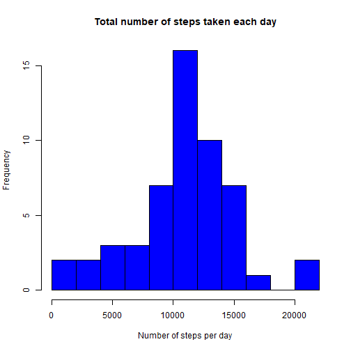
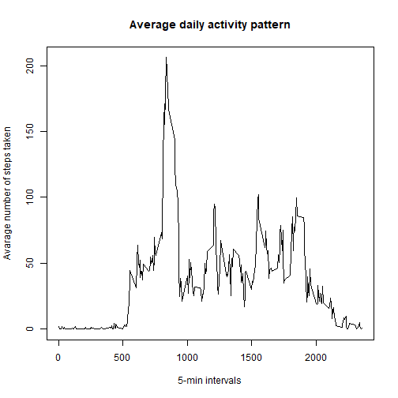
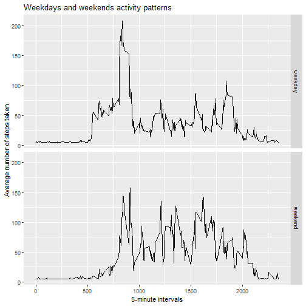

## Introduction

It is now possible to collect a large amount of data about personal movement using activity monitoring devices such as a Fitbit, Nike Fuelband, or Jawbone Up. These type of devices are part of the “quantified self” movement – a group of enthusiasts who take measurements about themselves regularly to improve their health, to find patterns in their behavior, or because they are tech geeks. But these data remain under-utilized both because the raw data are hard to obtain and there is a lack of statistical methods and software for processing and interpreting the data.

This assignment makes use of data from a personal activity monitoring device. This device collects data at 5 minute intervals through out the day. The data consists of two months of data from an anonymous individual collected during the months of October and November, 2012 and include the number of steps taken in 5 minute intervals each day.

The data for this assignment can be downloaded from the course web site:

Dataset: Activity monitoring data [52K]

The variables included in this dataset are:

steps: Number of steps taking in a 5-minute interval (missing values are coded as \color{red}{\verb|NA|}NA)

date: The date on which the measurement was taken in YYYY-MM-DD format

interval: Identifier for the 5-minute interval in which measurement was taken

The dataset is stored in a comma-separated-value (CSV) file and there are a total of 17,568 observations in this dataset.

## Loading and preprocessing the data


### Code for reading in the dataset and/or processing the data


```r
main_df <- read.csv("activity.csv", header = TRUE)
final_df <- na.omit(main_df)
```

## What is mean total number of steps taken per day?

### Histogram of the total number of steps taken each day


```r
steps_table <- aggregate(final_df$steps, by = list(Steps_per_day = final_df$date), FUN = "sum")
hist(steps_table$x, col = "blue", 
     breaks = 15,
     main = "Total number of steps taken each day",
     xlab = "Number of steps per day")
```



### Mean and median number of steps taken each day
 

```r
mean_steps <- mean(steps_table[,2])
print (mean_steps)
```

```
## [1] 10766.19
```

```r
median_steps <- median(steps_table[,2])
print (median_steps)
```

```
## [1] 10765
```

## What is the average daily activity pattern?


### Time series plot of the average number of steps taken

```r
daily_mean_steps <- aggregate(final_df$steps, 
                          by = list(Interval = final_df$interval), 
                          FUN = "mean")
plot(daily_mean_steps$Interval, daily_mean_steps$x, type = "l", 
     main = "Average daily activity pattern", 
     ylab = "Avarage number of steps taken", 
     xlab = "5-min intervals")
```



### The 5-minute interval that, on average, contains the maximum number of steps

```r
max_row_num <- which.max(daily_mean_steps$x)
max_interval <- daily_mean_steps[max_row_num,1]
print (max_interval)
```

```
## [1] 835
```

## Imputing missing values

### Calculate and report the total number of missing values in the dataset 

```r
NA_number <- length(which(is.na(main_df$steps)))
print (NA_number)
```

```
## [1] 2304
```

### Devise a strategy for filling in all of the missing values in the dataset.

The strategy is the filling the missing values by mean.

### Create a new dataset that is equal to the original dataset but with the missing data filled in.


```r
library(Hmisc)
```

```
## Warning: package 'Hmisc' was built under R version 4.0.2
```

```
## Loading required package: lattice
```

```
## Loading required package: survival
```

```
## Loading required package: Formula
```

```
## Loading required package: ggplot2
```

```
## 
## Attaching package: 'Hmisc'
```

```
## The following objects are masked from 'package:base':
## 
##     format.pval, units
```

```r
main_df_impute <- main_df
main_df_impute$steps <- impute(main_df$steps, fun=mean)
```
### Make a histogram of the total number of steps taken each day and Calculate and report the mean and median total number of steps taken per day. 


```r
steps_table_nonNa <- aggregate(main_df_impute$steps, 
                                by = list(Steps.Date = main_df_impute$date), 
                                FUN = "sum")
hist(steps_table_nonNa$x, col = "red", 
     breaks = 15,
     main = "Total number of steps taken each day (filled data)",
     xlab = "Number of steps per day")
```


```r
mean_steps_nonNA <- mean(steps_table_nonNa[,2])
print (mean_steps_nonNA)
```

```
## [1] 10766.19
```

```r
median_steps_nonNA <- median(steps_table_nonNa[,2])
print (median_steps_nonNA)
```

```
## [1] 10766.19
```

## Are there differences in activity patterns between weekdays and weekends?

### Create a new factor variable in the dataset with two levels – “weekday” and “weekend” indicating whether a given date is a weekday or weekend day.


```r
main_df_impute$day <- weekdays(as.Date(main_df_impute$date))
main_df_impute$type_day <- ""
main_df_impute[main_df_impute$day == "Cumartesi" | main_df_impute$day == "Pazar", ]$type_day <- "weekend"
main_df_impute[!(main_df_impute$day == "Cumartesi" | main_df_impute$day == "Pazar"), ]$type_day <- "weekday"
main_df_impute$type_day<- factor(main_df_impute$type_day)
```

### Make a panel plot containing a time series plot of the 5-minute interval (x-axis) and the average number of steps taken, averaged across all weekday days or weekend days (y-axis).
library(ggplot2)

```r
final_day_data <- aggregate(steps ~ interval + type_day, data=main_df_impute, mean)

ggplot(final_day_data, aes(interval, steps)) + 
        geom_line() + 
        facet_grid(type_day ~ .) +
        xlab("5-minute intervals") + 
        ylab("Avarage number of steps taken") +
        ggtitle("Weekdays and weekends activity patterns")
```


